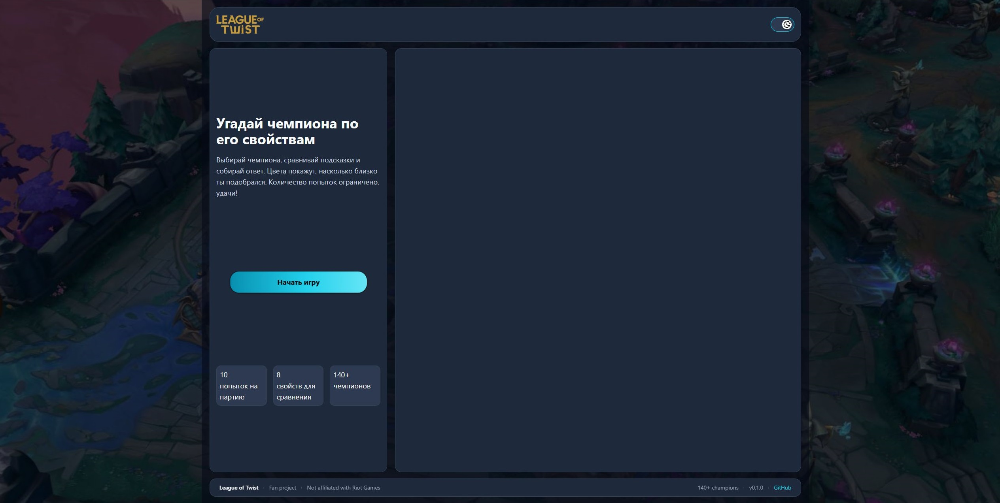
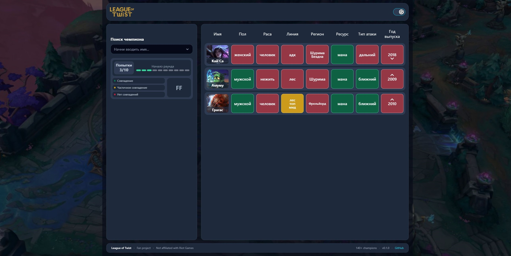
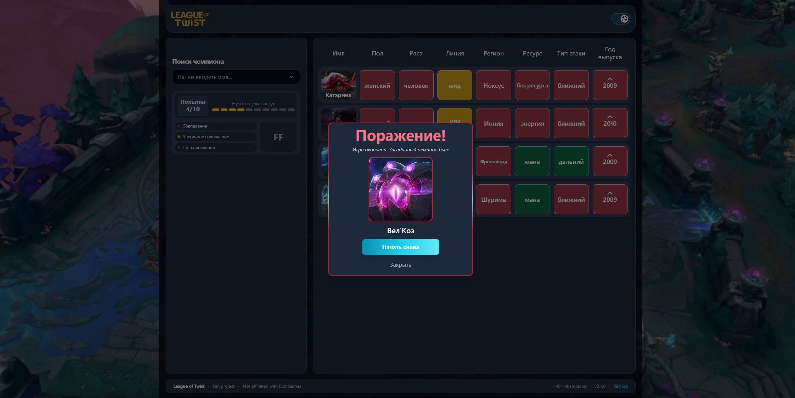

# League of Twist

Мини игра, в которой нужно угадывать персонажей из вселенной League of Legends по их свойствам (пол, раса, регион и тд..).

## Скриншоты игры

### Стартовый экран



### Главный экран



### Результат игры



## Демо

[Ссылка на демо](https://league-of-twist.vercel.app/)

## Возможности

- запуск новой игры;
- загадывание случайного персонажа игрой;
- поиск чемпиона по его имени;
- возможность вводить с английской раскладки клавиатуры;
- сравнивание загаданного и выбранного чемпиона;
- подсказки в виде цвета свойств карточки персонажа;
- возможность досрочно завершить игру;
- ограниченное количество попыток;
- модальное окно с результатом игры
- светлая и темная темная

## Технологии

- Type Script
- React
- Tailwind CSS v4
- Redux Toolkit
- Vite

## Структура проекта

```txt
src/
├── components/
│ ├── Footer/
│ ├── GuessingGame/
│ ├── Header/
│ └── ui/
├── lib/
├── Providers/
├── redux/
├── screens/
├── shared/
├── index.css
└── main.tsx
```

## Скрипты

```bash
npm run dev         # запуск dev-сервера
npm run build       # production-сборка
npm run preview     # предпросмотр сборки
npm run lint        # проверка ESLint
npm run format      # форматирование Prettier
npm run test        # запуск тестов в watch-режиме
npm run test:run    # запускает тесты один раз
```

## Запуск проекта

```bash
git clone https://github.com/ArturVictorovich/some_code.git
cd some_code/pet.proj1
npm install
npm run dev
```
